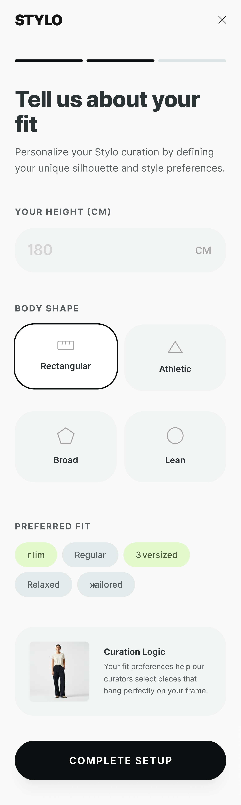
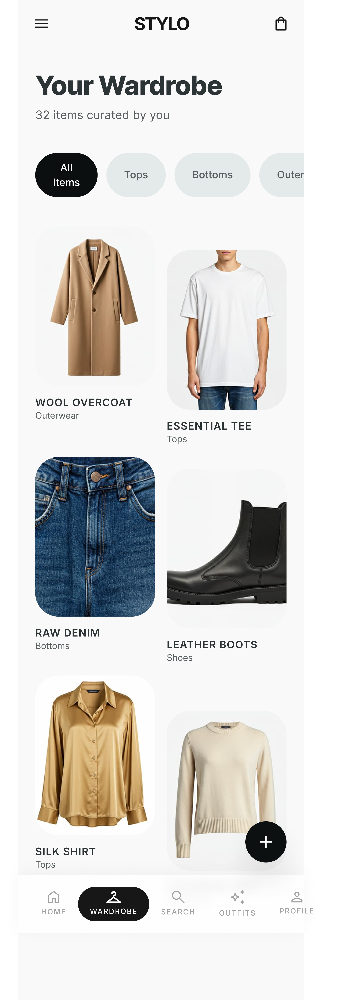
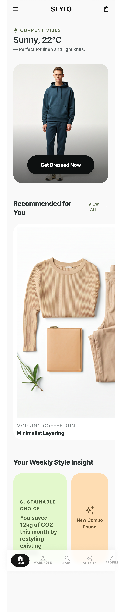
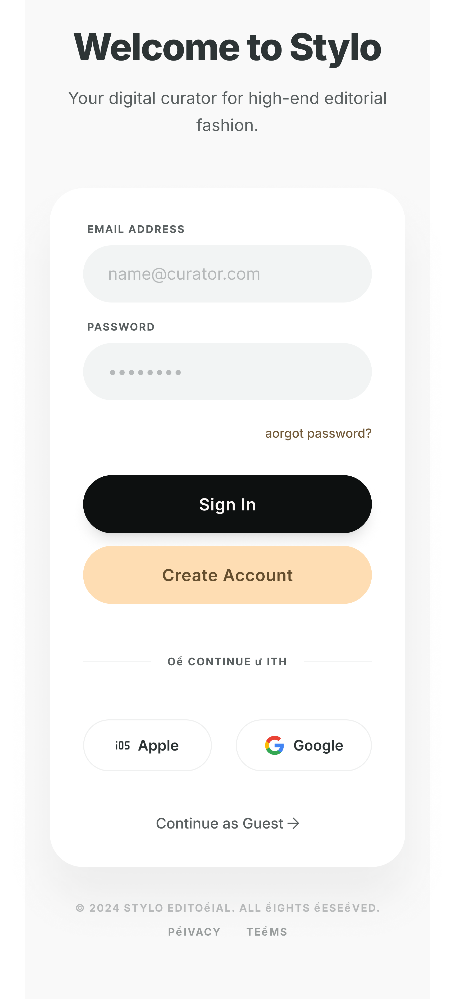
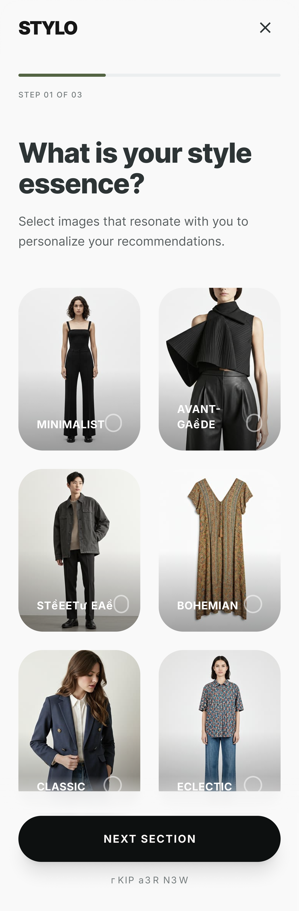
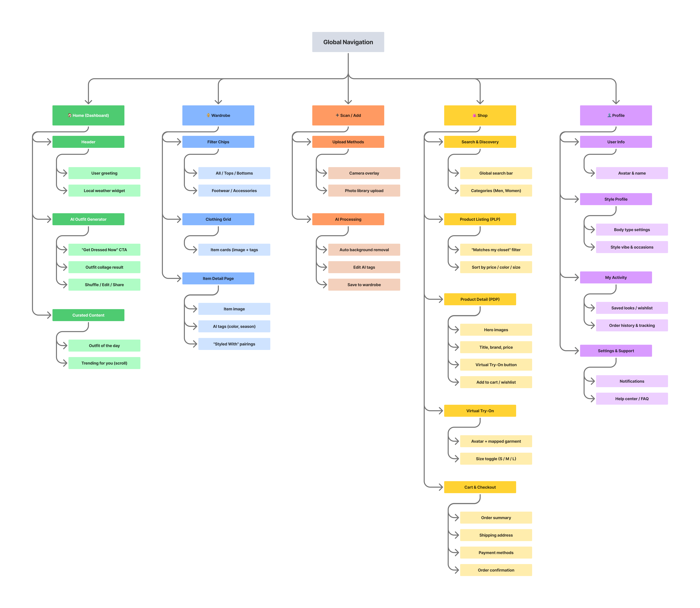
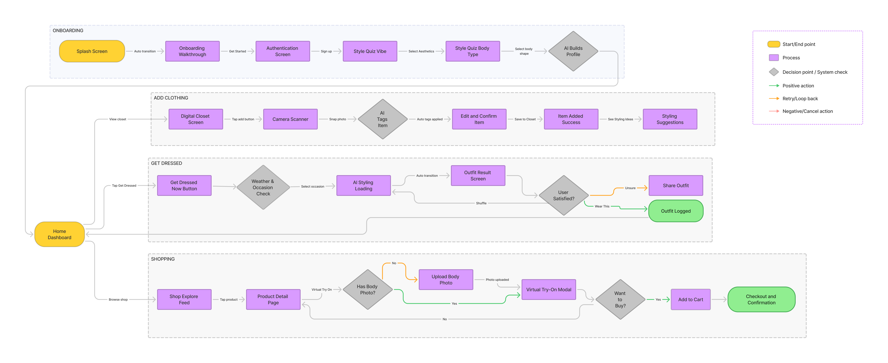

# Stylo AI Design System

🚧 This project is actively being developed as part of an open-source initiative.

Stylo is an AI-powered fashion styling app that helps users choose outfits based on body type, personality, and occasion.

---

## ✨ Features
- AI outfit recommendations  
- Virtual try-on concept  
- Digital wardrobe management  
- Personalized style quiz  

---

## 📦 What this repo includes
- UI/UX design screens  
- User flows & information architecture  
- Design system foundations  
- AI styling concept exploration  

---

## 🎯 Goal
To build an open-source design system for modern AI-powered fashion applications and improve user styling experiences using intelligent recommendations.

---

## 🤝 Contributions
Open to contributions, feedback, and improvements.

---

## 🖼️ Screens

### Body Profile Setup

### Digital Wardrobe

### Home Dashboard

### Sign Up

### Style Preference Quiz

---

## 🧭 System Design & Flow

### Stylo Information Architecture

### Stylo User Flow

---

## 🎨 Figma Files

### UI Design File
https://www.figma.com/design/1QoAdrJJtnyAhMnr8QRU2V/MP11-Submission-Template--Final-UI-Design-Of-Your-App--Copy-?node-id=0-1&t=3fOzAb58PEEaHLiz-1

### User Flow & IA (FigJam)
https://www.figma.com/board/BMVfGX7cTbKR35KuGcabKF/MP5-Building-User-Flows---Information-Architecture---Vishwajeet?node-id=0-1&t=mkCIvSMXRIQVOaHh-1

---

## 🚀 Future Improvements
- AI-based outfit recommendations engine  
- Real-time virtual try-on  
- Advanced personalization system  
- Mobile-first responsive design  

---
